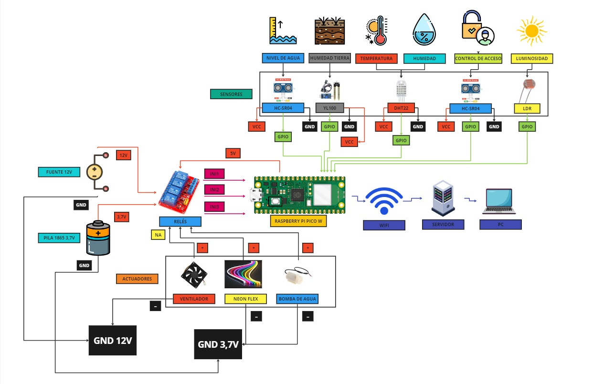

# Project Green Guardian

**Elaborado por:**
- Andres Felipe Penagos Betancur 1036686915
- Daniel Ruiz Guirales 1036688095

## Descripción

**Green Guardian** es un sistema de control automático para invernaderos, diseñado para monitorear y mantener las condiciones óptimas para el crecimiento de las plantas. Utiliza varios sensores y actuadores para controlar la temperatura, humedad del aire y del suelo, luminosidad, nivel de agua del tanque, y tiene un sistema de control de acceso.

## Características

- **Monitoreo de Temperatura y Humedad del Aire:** Utiliza sensores para medir la temperatura y humedad dentro del invernadero.
- **Monitoreo de Humedad del Suelo:** Sensores que garantizan que las plantas reciban la cantidad adecuada de agua.
- **Medición de Luminosidad:** Detecta los niveles de luz para asegurar que las plantas reciban la cantidad necesaria.
- **Control de Nivel de Tanque:** Un LED rojo se enciende cuando el tanque de agua necesita ser rellenado.
- **Sistema de Control de Acceso:** Un buzzer que alerta cuando hay un intento de acceso no autorizado.

## Actuadores Incluidos

- **Ventilador:** Para regular la temperatura y la humedad del aire.
- **Sistema de Riego:** Activa el riego según la humedad del suelo.
- **LED de Alerta de Tanque:** Indica cuando el tanque está vacío.
- **Buzzer de Control de Acceso:** Alerta de accesos no autorizados.

